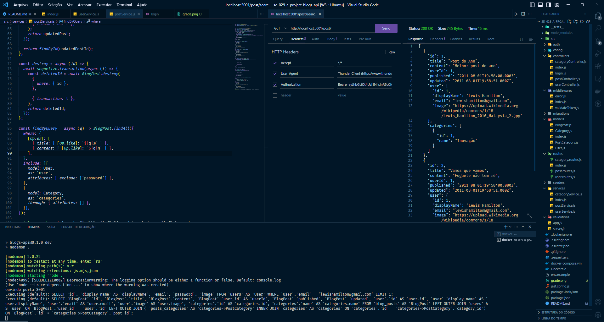
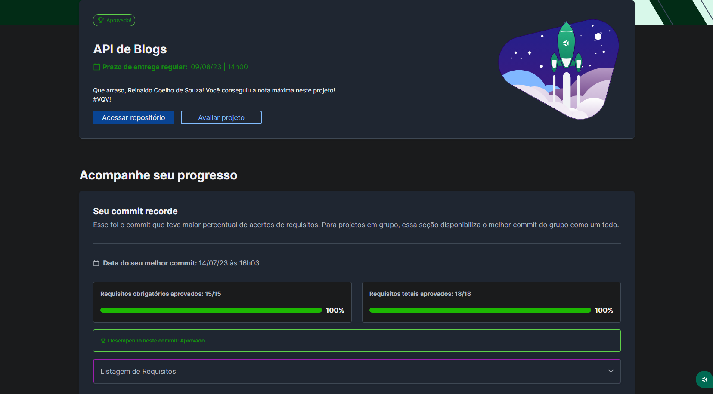

# 💻 Blogs API

## 📘 Sobre

Desenvolvi uma API e um banco de dados para construir um blog em Node.js, utilizando Sequelize para fazer um CRUD de posts.

## ⚛️ Ferramentas

- Sequelize;
- JWT (Jason Web Token);
- Node.js;
- Express.js;
- MySQL;
- Middlewares;
- Arquitetura em camadas (model, service e controller);
- Docker.

## 🛠️ Como executar o projeto?

1. Suba os containers da aplicação com `docker-compose up -d`.
2. Abra o terminal do container `docker exec -it blogs_api bash`.
3. Inicie o servidor `npm run dev`.

## 📝 Nota

